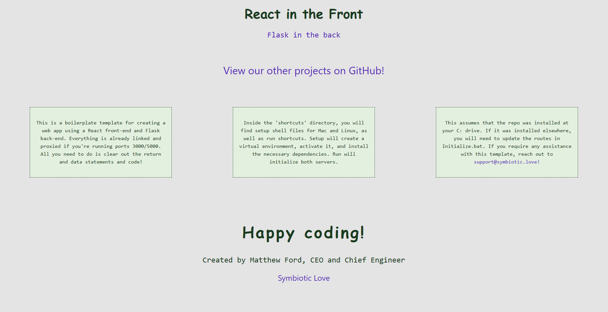

<h1>Basic React Front-End with Flask Back-End Boilerplate</h1>
This is a boilerplate template for a React web application running a Flask back-end. The setup files in the "shortcuts" directory will (assuming that the repo is installed at your C: drive) navigate to the project, create a virtual environment, and download the necessary dependencies (Flask, Flask-cors, npm). The run files will start both servers and display your React app. If you are on Mac or Linux, you will need to edit the shell files to replace "your-username" with your username.

&nbsp

React/Flask is a lightweight and versatile approach to web development. Combined, they can be used for almost any application. Flask is easy to use, allowing developers to have intricate control over the structure of applications and components. Flask has limitations when it comes to larger applications, so if you're looking for a massive and robust back-end, you should instead look to Django, which is more on-par with React in modularity and scalability. 

&nbsp

Everything is already proxied and ready to go as long as you are running ports 3000/5000. Happy coding!

&nbsp

